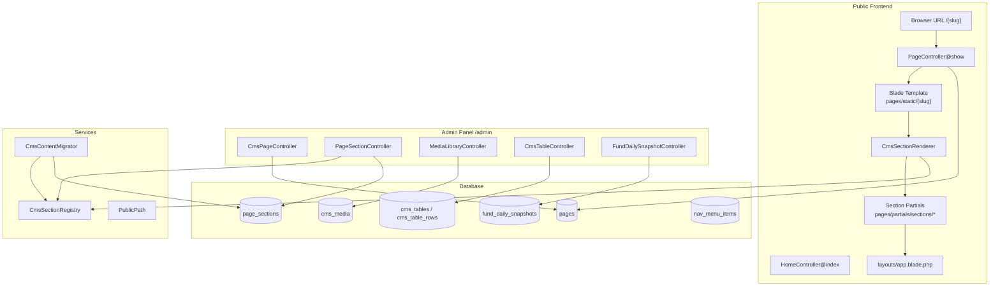
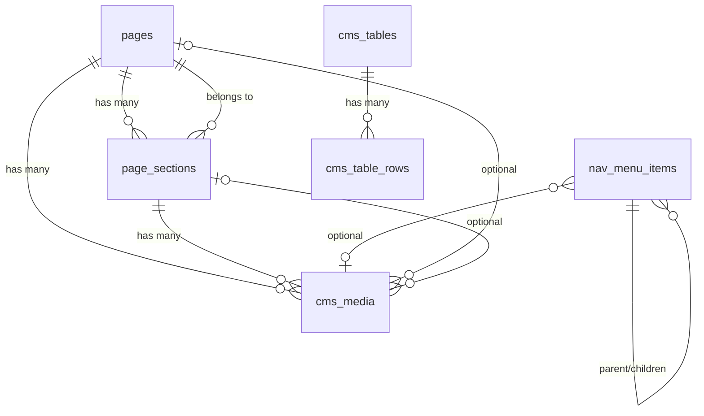
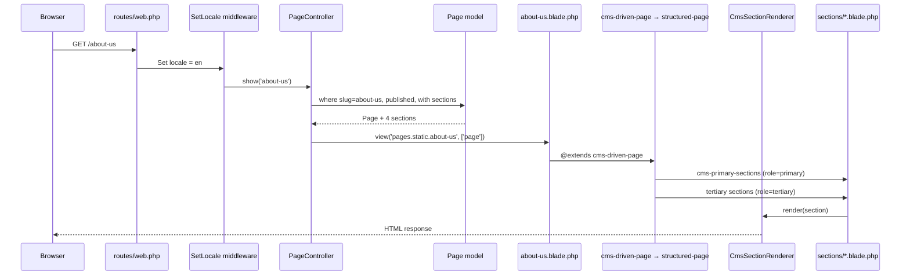
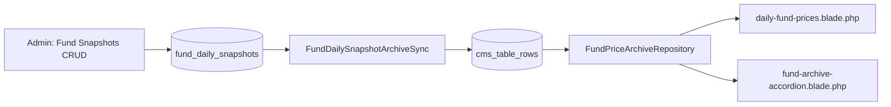
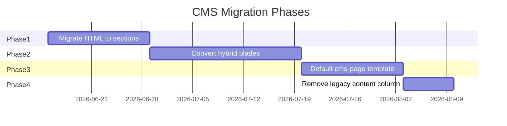

# CMS Architecture Analysis Report

**Project:** 5th Pillar Family Takaful — Laravel CMS  
**Date:** June 15, 2026  
**Audience:** Senior Laravel engineers planning the next CMS phase  
**Context:** WordPress → Laravel migration; hybrid HTML + section-based content model

---

## Executive Summary

This Laravel application migrated ~94 pages from WordPress. Content is stored primarily in the `pages.content` column as scraped HTML (WPBakery/Visual Composer markup, shortcodes, inline styles). A **section system** (`page_sections`) exists and is partially implemented, but only **6 of 94 pages** currently use it. Most pages render through **dedicated Blade templates** with hardcoded markup or legacy HTML fallbacks.

The CMS admin panel supports page metadata, SEO fields, bilingual content, a media library, section CRUD with drag-and-drop reorder, fund price snapshots, and dynamic data tables. The gap between current behavior and WordPress/Elementor-like editing is architectural: **the frontend still prefers Blade templates and hardcoded fallbacks over database-driven sections**.

| Metric | Value |
|--------|-------|
| Total pages in DB | 94 |
| Pages with `page_sections` records | 6 |
| Pages with legacy `content` HTML | 84 |
| Section types defined in config | 20 |
| Dedicated static Blade templates | 94 |
| Pages using `cms-driven-page` layout | 1 (`about-us`) |

---

## 1. High Level Architecture

### 1.1 Overview

The CMS follows a classic Laravel MVC pattern with service-layer helpers for section rendering, content normalization, and media path rewriting.



### 1.2 How Pages Are Stored

Pages are Eloquent models (`App\Models\Page`) backed by the `pages` table. Each row represents one public URL slug.

**Storage layers (coexist today):**

| Layer | Column / Table | Purpose |
|-------|----------------|---------|
| Legacy HTML | `pages.content`, `pages.content_ur` | WordPress-scraped full-page HTML |
| Page metadata | `title`, `slug`, `view_key`, `hero_title`, `masthead_bg`, SEO fields | Shell + SEO |
| Structured sections | `page_sections` (JSON `content`, JSON `settings`) | Modular blocks |
| Page attachments | `cms_media` (page-level, `page_section_id` null) | Downloads list |
| Status | `status` / `is_published` | Draft vs published |

### 1.3 How Pages Are Rendered

1. **Route** matches `GET /{slug}` (or `/urdu/{slug}`).
2. **`PageController@show`** loads published page with enabled sections + media.
3. **Template resolution:** `pages.static.{view_key ?: slug}` if Blade exists; else `pages.static.cms-generic`.
4. **Blade layout** (`structured-page` or `cms-driven-page`) yields content areas.
5. **`CmsSectionRenderer`** maps each `PageSection` to a partial by `section_type`.
6. **Fallback:** If no CMS sections, Blade hardcoded markup or `{!! $page->content !!}` is used.

### 1.4 Content Flow: Database → Frontend

```
pages (row)
  ├─ sections[] ordered by sort_order, filtered by is_enabled
  │    ├─ section_type → config/cms.php → view partial name
  │    ├─ content (JSON) → normalized by CmsSectionRegistry
  │    └─ settings.role → primary | append | tertiary | home
  ├─ media[] → cms-page-blocks downloads
  └─ content (legacy) → cms-generic fallback only

PageSection
  → CmsSectionRenderer::render($section)
  → view('pages.partials.sections.{view}', [...])
  → HTML fragment embedded in structured-page layout
```

### 1.5 Models Controlling CMS Functionality

| Model | Path | Responsibility |
|-------|------|----------------|
| `Page` | `app/Models/Page.php` | Page records, slug, SEO, legacy content, relations |
| `PageSection` | `app/Models/PageSection.php` | Section blocks, JSON content/settings |
| `CmsMedia` | `app/Models/CmsMedia.php` | Images, PDFs, library assets |
| `NavMenuItem` | `app/Models/NavMenuItem.php` | Header/footer navigation tree |
| `CmsTable` | `app/Models/CmsTable.php` | Dynamic table definitions |
| `CmsTableRow` | `app/Models/CmsTableRow.php` | Dynamic table row data |
| `SiteSetting` | `app/Models/SiteSetting.php` | Key/value site config |
| `FundDailySnapshot` | `app/Models/FundDailySnapshot.php` | Daily fund price row |

### 1.6 Controllers Managing Pages

| Controller | Path | Role |
|------------|------|------|
| `PageController` | `app/Http/Controllers/PageController.php` | Public page resolution by slug |
| `HomeController` | `app/Http/Controllers/HomeController.php` | Homepage (slug `home`, not catch-all) |
| `CmsPageController` | `app/Http/Controllers/Admin/CmsPageController.php` | Admin page CRUD, preview |
| `PageSectionController` | `app/Http/Controllers/Admin/PageSectionController.php` | Section CRUD, reorder, duplicate |
| `MediaLibraryController` | `app/Http/Controllers/Admin/MediaLibraryController.php` | Central media library |
| `CmsMediaController` | `app/Http/Controllers/Admin/CmsMediaController.php` | Page-attached uploads |
| `CmsTableController` | `app/Http/Controllers/Admin/CmsTableController.php` | Admin data tables |
| `FundDailySnapshotController` | `app/Http/Controllers/Admin/FundDailySnapshotController.php` | Daily fund prices |
| `NavMenuController` | `app/Http/Controllers/Admin/NavMenuController.php` | Navigation CRUD |

### 1.7 Blade Files Rendering Pages

| Category | Path Pattern |
|----------|--------------|
| App shell | `resources/views/layouts/app.blade.php` |
| Inner page layout | `resources/views/pages/layouts/structured-page.blade.php` |
| CMS-driven layout | `resources/views/pages/layouts/cms-driven-page.blade.php` |
| Static page templates | `resources/views/pages/static/{slug}.blade.php` (94 files) |
| Generic fallback | `resources/views/pages/static/cms-generic.blade.php` |
| Section partials | `resources/views/pages/partials/sections/*.blade.php` |
| CMS composition | `resources/views/pages/partials/cms-primary-sections.blade.php` |
| Homepage | `resources/views/home/index.blade.php` |
| Admin | `resources/views/admin/pages/edit.blade.php` |

---

## 2. Database Structure

### 2.1 Entity Relationship Diagram



### 2.2 Table: `pages`

**Purpose:** Core page registry — one row per URL slug.

**Important columns:**

| Column | Type | Notes |
|--------|------|-------|
| `id` | bigint PK | |
| `title`, `title_ur` | string | Display title (bilingual) |
| `slug` | string unique | URL segment, e.g. `about-us` |
| `view_key` | string nullable | Overrides Blade template name |
| `content`, `content_ur` | longText | **Legacy WordPress HTML** |
| `meta_title`, `meta_title_ur` | string | SEO |
| `meta_description`, `meta_description_ur` | text | SEO |
| `meta_keywords` | string | SEO (admin only today) |
| `og_image` | string | Open Graph path (not rendered publicly yet) |
| `hero_title`, `hero_title_ur` | string | Masthead H1 |
| `masthead_bg`, `masthead_bg_ur` | string | CSS background value |
| `status` | string | `draft` \| `published` |
| `is_published` | boolean | Synced with `status` in model boot |
| `sort_order` | int | Admin list ordering |

**Relationships:**
- `hasMany` → `page_sections` (ordered by `sort_order`)
- `hasMany` → `cms_media` where `page_section_id` IS NULL

**Sample record (about-us):**

```json
{
  "id": 42,
  "title": "About Us",
  "slug": "about-us",
  "view_key": null,
  "content": "<div class=\"wpb_row vc_row-fluid\">...</div>",
  "meta_title": "About Us - 5th Pillar Family Takaful",
  "hero_title": "About Us",
  "status": "published",
  "sort_order": 0
}
```

**Migrations:**
- `database/migrations/2026_04_20_214000_create_pages_table.php`
- `database/migrations/2026_04_26_153923_cms_extend_pages_add_sections_media_fund_snapshots.php`
- `database/migrations/2026_06_16_000001_cms_phase1_foundation.php`

---

### 2.3 Table: `page_sections`

**Purpose:** Modular content blocks per page (the section-based CMS core).

**Important columns:**

| Column | Type | Notes |
|--------|------|-------|
| `id` | bigint PK | |
| `page_id` | FK → pages | cascade delete |
| `sort_order` | int | Drag-and-drop order |
| `section_type` | string | Key from `config/cms.php` |
| `heading`, `heading_ur` | string | Optional section heading |
| `body_html`, `body_html_ur` | longText | Legacy per-section HTML |
| `content` | JSON | Structured fields per type |
| `settings` | JSON | `role`, `slot`, `wrapper_class`, etc. |
| `is_enabled` | boolean | Toggle visibility |

**Relationships:**
- `belongsTo` → `pages`
- `hasMany` → `cms_media`

**Sample record (about-us intro):**

```json
{
  "id": 101,
  "page_id": 42,
  "sort_order": 0,
  "section_type": "intro_milestones",
  "content": {
    "lead": "5th Pillar Family Takaful Limited is a new entrant...",
    "items": [
      {"text": "Largest FDI in Takaful sector of Pakistan"},
      {"text": "Foreign shareholders own 68%..."}
    ]
  },
  "settings": {"role": "primary"},
  "is_enabled": true
}
```

---

### 2.4 Table: `cms_media`

**Purpose:** Uploaded files and media library assets.

**Important columns:**

| Column | Type | Notes |
|--------|------|-------|
| `page_id` | FK nullable | Page attachment |
| `page_section_id` | FK nullable | Section attachment |
| `disk` | string | `assets` or `public` |
| `path` | string | e.g. `assets/images/team/ceo.webp` |
| `folder` | string | Library folder key |
| `asset_type` | string | `image`, `pdf`, `file` |
| `mime`, `file_size`, `alt_text`, `label` | | Metadata |

**Library items:** Both `page_id` and `page_section_id` are NULL (`CmsMedia::scopeLibrary()`).

**Relationships:**
- `belongsTo` → `pages`, `page_sections`
- Referenced by `nav_menu_items.cms_media_id`

---

### 2.5 Table: `nav_menu_items`

**Purpose:** Site navigation tree (no separate `menus` table).

| Column | Notes |
|--------|-------|
| `parent_id` | Self-referential nesting |
| `sort_order` | Sibling order |
| `label`, `label_ur` | Display text |
| `link_type` | `home`, `page_slug`, `named_route`, `custom_url`, `media`, `none` |
| `page_slug`, `route_name`, `custom_url` | Link targets |
| `cms_media_id` | PDF/media link |
| `open_new_tab` | boolean |

**URL resolution:** `App\Services\SiteNavigationService`

**Known gap:** `label_ur` exists in DB but is missing from `NavMenuItem::$fillable`.

---

### 2.6 Tables: `cms_tables` + `cms_table_rows`

**Purpose:** Admin-editable tabular data (fund price archives).

**`cms_tables`:**

| Column | Notes |
|--------|-------|
| `key` | Unique identifier, e.g. `fund_prices_archive` |
| `label`, `description` | Admin display |
| `schema` | JSON column definitions |
| `settings` | JSON grouping/filter config |

**`cms_table_rows`:**

| Column | Notes |
|--------|-------|
| `cms_table_id` | FK |
| `sort_order` | Row order |
| `data` | JSON row payload |
| `is_enabled` | boolean |

**Sample row (`fund_prices_archive`):**

```json
{
  "year": 2026,
  "month": "June",
  "date": "02-Jun-2026",
  "agg_bid": "10.2345",
  "agg_offer": "10.4567",
  "bal_bid": "9.1234",
  "bal_offer": "9.3456",
  "con_bid": "8.0123",
  "con_offer": "8.2345"
}
```

---

### 2.7 Table: `fund_daily_snapshots`

**Purpose:** Latest daily fund prices (separate from archive accordion).

| Column | Notes |
|--------|-------|
| `price_date` | date, unique |
| `agg_bid`, `agg_offer`, `bal_bid`, `bal_offer`, `con_bid`, `con_offer` | string |

**Sync:** Model events call `FundDailySnapshotArchiveSync` to push rows into `cms_table_rows`.

---

### 2.8 Table: `site_settings`

**Purpose:** Key/value JSON config (email settings, etc.).

| Column | Notes |
|--------|-------|
| `key` | unique string |
| `value` | JSON |

---

## 3. Page Rendering Flow: `/about-us`

### 3.1 Request Trace



### 3.2 Step-by-Step with File Paths

| Step | Component | Path / Method |
|------|-----------|---------------|
| 1 | Route | `routes/web.php` → `Route::get('/{slug}', [PageController::class, 'show'])` |
| 2 | Middleware | `app/Http/Middleware/SetLocale.php` |
| 3 | Controller | `app/Http/Controllers/PageController.php` → `show(string $slug)` |
| 4 | Model query | `App\Models\Page::query()->where('slug', $slug)->published()->with(['sections', 'media'])` |
| 5 | Template pick | `view_key ?: slug` → `about-us` → `pages.static.about-us` exists |
| 6 | View | `resources/views/pages/static/about-us.blade.php` |
| 7 | Layout | `resources/views/pages/layouts/cms-driven-page.blade.php` |
| 8 | Parent layout | `resources/views/pages/layouts/structured-page.blade.php` |
| 9 | App shell | `resources/views/layouts/app.blade.php` |
| 10 | Primary sections | `resources/views/pages/partials/cms-primary-sections.blade.php` |
| 11 | Service | `app/Services/CmsSectionRenderer.php` → `primarySections()`, `render()` |
| 12 | Registry | `app/Services/CmsSectionRegistry.php` → `viewName('intro_milestones')` |
| 13 | Partial | `resources/views/pages/partials/sections/intro-milestones.blade.php` |
| 14 | Tertiary bands | `structured-page` lines 84–88 → `tertiarySections()` → `sponsor-band`, `image-band`, `text-band` |

### 3.3 Controller Code (resolution logic)

```php
// app/Http/Controllers/PageController.php
public function show(string $slug): ViewContract
{
    $page = Page::query()
        ->where('slug', $slug)
        ->published()
        ->with([
            'sections' => fn ($q) => $q->where('is_enabled', true)->orderBy('sort_order'),
            'media',
        ])
        ->firstOrFail();

    $viewKey = $page->templateSlug(); // view_key ?: slug
    $view = 'pages.static.'.$viewKey;

    if (! View::exists($view)) {
        $view = 'pages.static.cms-generic';
    }

    return view($view, ['page' => $page]);
}
```

### 3.4 About Us Section Stack (current DB)

| Order | Type | Role | Partial |
|-------|------|------|---------|
| 0 | `intro_milestones` | primary | `intro-milestones.blade.php` |
| 1 | `sponsor_band` | tertiary | `sponsor-band.blade.php` |
| 2 | `image_band` | tertiary | `image-band.blade.php` |
| 3 | `text_band` | tertiary | `text-band.blade.php` |

---

## 4. Current Page Storage Analysis

### 4.1 Storage Mode Summary

| Storage mode | Page count | % of total |
|--------------|------------|------------|
| Legacy HTML in `pages.content` | 84 | 89% |
| Structured `page_sections` | 6 | 6% |
| Both HTML + sections | 6 | (all section pages still have legacy HTML) |
| Hardcoded Blade only (no DB body) | ~25 substantive blades | — |

*Source: `scripts/cms-page-storage-audit.php` run against local DB.*

### 4.2 Pages Using Sections (complete list)

| Slug | Sections | Types | Dynamic level |
|------|----------|-------|---------------|
| `home` | 5 | `home_popup`, `hero_slider`, `home_about_banner`, `icon_cards`, `value_chain` | Partially dynamic (hardcoded fallbacks in `home/index.blade.php`) |
| `about-us` | 4 | `intro_milestones`, `sponsor_band`, `image_band`, `text_band` | **Fully CMS-driven** via `cms-driven-page` |
| `management-team` | 1 | `team_grid` | Hybrid — CMS section + hardcoded team array fallback |
| `financial-statements` | 1 | `pdf_table` | Hybrid — CMS rows + hardcoded PDF links fallback |
| `fund-managers-report` | 1 | `pdf_table` | Hybrid — CMS + `FundManagersReportRepository` fallback |
| `accounts-of-unit-linked-funds` | 1 | `pdf_table` | Hybrid — CMS + hardcoded PDF links fallback |

### 4.3 Storage Classification by Page Category

#### A. Fully dynamic (sections are source of truth on frontend)

- `about-us` — extends `cms-driven-page`; no hardcoded body

#### B. Partially dynamic (CMS section OR hardcoded fallback)

- `home` — `CmsSectionRenderer::homeSection($page, $slot)` with Blade fallbacks
- `management-team` — `primarySection($page, 'team_grid')` with PHP array fallback
- `financial-statements`, `fund-managers-report`, `accounts-of-unit-linked-funds` — `pdf_table` with hardcoded rows

#### C. Legacy HTML only (cms-generic or Blade ignores sections for primary content)

- 78 pages with `content` HTML but **no sections** — would render via `cms-generic` if no dedicated Blade exists
- Most have dedicated Blades that **ignore** `pages.content` entirely

#### D. Hardcoded Blade (substantive content in template)

Examples: `contact.blade.php`, `board-of-directors.blade.php`, `vision-mission.blade.php`, `careers.blade.php`, `privacy-policy.blade.php`, product/savings plan pages

#### E. Data-driven (not page_sections)

- `daily-fund-prices` — `FundDailySnapshot` model
- `fund-price-archive-20xx` — `CmsTable` / `fund_price_archives.php`
- `hajj-planner` — dedicated route + `FinancialData` model (static slug page is a stub)

#### F. Placeholder stubs

58 slugs in `config/cms.php` → `legacy_demo_slugs` — Blade shows "Page in progress"

### 4.4 Content Format Examples

**Legacy HTML (`pages.content`):**

```html
<div class="wpb_row vc_row-fluid">
  <div class="wpb_column vc_column_container vc_col-sm-12">
    <div class="vc_column-inner">
      <div class="wpb_wrapper">
        <h2 class="vc_custom_heading">Our Sponsors</h2>
        ...
      </div>
    </div>
  </div>
</div>
```

**Structured section JSON (`page_sections.content`):**

```json
{
  "heading": "Our Sponsors",
  "blocks": [
    {"strong": "KIIC", "text": " is a leading investment company..."}
  ]
}
```

**Hardcoded Blade (vision-mission):**

```blade
@section('structured_primary')
    <p>Our vision is to become the most trusted...</p>
@endsection
```

---

## 5. Section System Analysis

### 5.1 `page_sections` Schema

See Section 2.3. The section system is the intended WordPress/Elementor replacement.

### 5.2 Section Roles (`settings.role`)

| Role | Render location | Service method |
|------|-----------------|----------------|
| `primary` | Main content column | `CmsSectionRenderer::primarySections()` |
| `append` | Below primary, inside content wrap | `appendSections()` via `cms-page-blocks` |
| `tertiary` | Full-width bands below page | `tertiarySections()` in `structured-page` |
| `home` | Homepage slots | `homeSection($page, $slot)` |

### 5.3 All Section Types (`config/cms.php`)

**Canonical structured types (WordPress-like building blocks):**

| Type | Admin label | View partial | Roles |
|------|-------------|--------------|-------|
| `text` | Text section | `text.blade.php` | primary, append, tertiary |
| `image` | Image section | `image.blade.php` | primary, append, tertiary |
| `gallery` | Gallery section | `gallery.blade.php` | primary, append, tertiary |
| `video` | Video section | `video.blade.php` | primary, append, tertiary |
| `pdf` | PDF download | `pdf.blade.php` | primary, append, tertiary |
| `table` | Data table | `table.blade.php` | primary, append, tertiary |
| `rich_content` | Rich content (Trix) | `rich-content.blade.php` | primary, append, tertiary |

**Legacy / domain-specific types:**

| Type | Purpose | Roles |
|------|---------|-------|
| `content` | Heading + HTML body | append |
| `html` | Free-form HTML in JSON | append, primary |
| `pdf_table` | Two-column PDF download table | primary, append |
| `intro_milestones` | About intro + bullet list | primary |
| `sponsor_band` | Sponsors full-width band | tertiary |
| `image_band` | Heading + image band | tertiary |
| `text_band` | Full-width text band | tertiary |
| `team_grid` | Management team cards | primary |
| `home_popup` | Homepage modal | home (slot: popup) |
| `hero_slider` | Homepage slider | home (slot: hero) |
| `home_about_banner` | About strip | home (slot: about) |
| `icon_cards` | Mission/vision cards | home (slot: mission) |
| `value_chain` | Value chain panel | home (slot: value_chain) |

### 5.4 Rendering Pipeline

```php
// app/Services/CmsSectionRenderer.php
public function render(PageSection $section): ViewContract|string
{
    $type = $section->section_type ?: 'content';
    $view = 'pages.partials.sections.'.$this->registry->viewName($type);

    if (! View::exists($view)) {
        $view = 'pages.partials.sections.content';
    }

    return view($view, [
        'section' => $section,
        'content' => $section->content ?? [],
        'settings' => $section->settings ?? [],
        'registry' => $this->registry,
    ]);
}
```

**Normalization on save:** `CmsSectionRegistry::normalizeContent()` / `normalizeSettings()` called from `PageSectionController::validatedSection()`.

### 5.5 Admin Section Management

| Feature | Implementation |
|---------|----------------|
| Add section | `POST /admin/pages/{page}/sections` → `PageSectionController@store` |
| Update section | `PUT /admin/pages/{page}/sections/{section}` |
| Delete section | `DELETE` same |
| Duplicate | `POST .../duplicate` — clones as disabled |
| Enable/disable | `is_enabled` checkbox in section form |
| Reorder | `PUT .../sections/reorder` — JSON `{ order: [id, ...] }` |
| Drag-and-drop UI | `public/assets/js/admin/cms-section-editor.js` |

Admin UI: `resources/views/admin/pages/edit.blade.php` — section navigator + per-section forms.

Field definitions: `resources/views/admin/pages/partials/section-fields/structured-sections.blade.php`

### 5.6 Migration Tool

```bash
php artisan cms:migrate-content-to-sections about-us --force
php artisan cms:migrate-content-to-sections --all --dry-run
```

- **Service:** `app/Services/CmsContentMigrator.php`
- **Command:** `app/Console/Commands/MigratePageContentToSectionsCommand.php`
- **Logic:** Known pages (e.g. `about-us`) get hand-crafted section maps; others parse `pages.content` HTML via DOM into `rich_content` sections.

### 5.7 Usage Status

**Sections are implemented but underutilized.** Only 6 pages have section records. 88 pages rely on Blade templates and/or legacy HTML. New canonical types (`text`, `image`, etc.) are defined and have admin forms but are not yet populated in production data (about-us uses legacy band types from Phase 4 seeding).

---

## 6. Media Library Analysis

### 6.1 Upload Paths

| Entry point | Controller | Physical storage | DB `disk` | Path pattern |
|-------------|------------|------------------|-----------|--------------|
| Media library | `MediaLibraryController` | `public/assets/{folder}/` | `assets` | `assets/images/...` |
| Page upload | `CmsMediaController` | `storage/app/public/cms/Y/m/` | `public` | `cms/2026/06/...` |
| Nav menu upload | `NavMenuMediaController` | `storage/app/public/cms/menu/Y/m/` | `public` | `cms/menu/2026/06/...` |

**Service:** `app/Services/CmsMediaStorage.php`

### 6.2 Configured Folders (`config/cms.php` → `media`)

**Images:** `images`, `images/home`, `images/products`, `images/news`, `images/team`, `images/banners`

**PDFs:** `pdf`, `pdf/reports`, `pdf/forms`, `pdf/investors`

**Max upload:** 50 MB (`max_upload_kb` => 51200)

### 6.3 URL Generation

```php
// app/Models/CmsMedia.php
public function publicUrl(): string
{
    // disk=assets → asset($path)
    // disk=public → Storage::url($path)
    // PDFs → PublicPath::ensurePdfViewerUrl() for inline viewer
}
```

```php
// app/Models/Page.php
public function ogImageUrl(): ?string
{
    return asset(ltrim($this->og_image, '/'));
}
```

**Path rewriting:** `App\Support\PublicPath` rewrites legacy `wp-content/uploads/` and `/uploads/` references in HTML to `assets/`.

**Media picker API:** `GET /admin/media/picker` → JSON with `url`, `path`, `public_url`

### 6.4 Frontend Usage

- Page downloads: `resources/views/pages/partials/cms-page-blocks.blade.php`
- Section images/PDFs: stored as paths in `page_sections.content` JSON, resolved via `asset()` / `PublicPath`
- OG image: stored in `pages.og_image` but **not output in public `<head>` yet**

### 6.5 Video Handling

- Section type `video` supports `video_file`, `embed_url`, `thumbnail` in JSON
- No dedicated video transcoding pipeline — files stored like other uploads
- Partial: `resources/views/pages/partials/sections/video.blade.php`

---

## 7. Table Management Analysis

### 7.1 Daily Fund Prices



| Component | Path |
|-----------|------|
| Model | `app/Models/FundDailySnapshot.php` |
| Admin controller | `app/Http/Controllers/Admin/FundDailySnapshotController.php` |
| Admin views | `resources/views/admin/fund-snapshots/` |
| Public page | `resources/views/pages/static/daily-fund-prices.blade.php` |
| Table partial | `resources/views/pages/partials/fund-price-daily-snapshot.blade.php` |
| Archive pages | `resources/views/pages/static/fund-price-archive-20xx.blade.php` |
| Archive partial | `resources/views/pages/partials/fund-archive-accordion.blade.php` |
| Repository | `app/Services/FundPriceArchiveRepository.php` |
| Legacy fallback | `resources/data/fund_price_archives.php` |
| Sync scripts | `scripts/sync-fund-pages-from-live.php` |

**Admin flow:** Create/edit snapshot row → auto-syncs to `cms_tables` key `fund_prices_archive`.

**Frontend flow:** Latest snapshot by `price_date` DESC; archive pages group rows by year/month accordion.

### 7.2 CMS Dynamic Tables (generic)

| Component | Path |
|-----------|------|
| Config schema | `config/cms.php` → `tables.fund_prices_archive` |
| Models | `app/Models/CmsTable.php`, `CmsTableRow.php` |
| Registry | `app/Services/CmsTableRegistry.php` |
| Admin | `app/Http/Controllers/Admin/CmsTableController.php` |
| Admin views | `resources/views/admin/cms-tables/` |
| Import | `php artisan cms:import-tables` |

**Note:** Section-level `table` type stores columns/rows in `page_sections.content` JSON — separate from `cms_tables`.

### 7.3 Hajj & Umrah Planner

| Component | Path |
|-----------|------|
| Live route | `GET /hajj-planner` → `HajjPlannerController@index` |
| View | `resources/views/hajj-planner.blade.php` (extends `layouts.app`, not `structured-page`) |
| API | `POST /api/hajj-planner/calculate` |
| Engine | `app/Services/FinancialPlannerEngine.php` |
| Data model | `app/Models/FinancialData.php` |
| Leads | `app/Models/HajjPlanLead.php` |
| Admin import | `admin/financial-data` → `FinancialDataController` |
| Stub page | `pages/static/hajj-planner.blade.php` (placeholder if hit via slug route) |

**Not CMS-managed** — calculator logic, chart data, and financial assumptions are code + imported spreadsheet data.

### 7.4 Fund Managers Report

| Component | Path |
|-----------|------|
| Page | `resources/views/pages/static/fund-managers-report.blade.php` |
| Data | `resources/data/fund_managers_reports.php` |
| Repository | `app/Support/FundManagersReportRepository.php` |
| CMS section | Optional `pdf_table` primary section |
| Sync | `scripts/sync-fund-pages-from-live.php` |

---

## 8. SEO System Analysis

### 8.1 Stored Fields

| Field | Urdu variant | Table | Admin editable |
|-------|--------------|-------|----------------|
| `meta_title` | `meta_title_ur` | `pages` | Yes |
| `meta_description` | `meta_description_ur` | `pages` | Yes |
| `meta_keywords` | — | `pages` | Yes |
| `og_image` | — | `pages` | Yes (media picker) |
| `hero_title` | `hero_title_ur` | `pages` | Yes (masthead H1, not `<title>`) |
| `slug` | — | `pages` | Yes (manual, pattern validated) |

**Slug generation:** Manual entry in admin — no auto-slugify from title on save (unlike WordPress).

### 8.2 Where Rendered

| Field | Public output | Location |
|-------|---------------|----------|
| `meta_title` | `<title>` | `structured-page.blade.php` → `@section('title')` via `$page->trans('meta_title')` |
| `meta_description` | `<meta name="description">` | `structured-page` `@push('head')` when filled |
| `meta_keywords` | **Not rendered** | Admin only |
| `og_image` | **Not rendered** | `Page::ogImageUrl()` exists but unused in layouts |
| `hero_title` | Masthead `<h1>` | `structured-page` header masthead |
| `masthead_bg` | CSS `--laravel-inner-masthead-bg` | Inline style on masthead |

Many blades override SEO with `@section('structured_meta_title', 'Hardcoded Title')` instead of using DB values.

### 8.3 Bilingual Resolution

```php
// app/Models/Page.php
public function trans(string $attribute): mixed
{
    $locale = app()->getLocale();
    if (($locale === 'ur' || $locale === 'urdu') && !empty($this->{$attribute.'_ur'})) {
        return $this->{$attribute.'_ur'};
    }
    return $this->{$attribute};
}
```

Urdu routes: `/urdu/{slug}` with `SetLocale` middleware setting `app()->setLocale('ur')`.

---

## 9. Frontend Template Analysis

### 9.1 Template Resolution Rules

```
view_key ?: slug  →  pages/static/{name}.blade.php
                  →  fallback: cms-generic.blade.php
```

Homepage is special: `GET /` → `home/index.blade.php` (not slug route).

### 9.2 Template Categories

#### Tier 1 — CMS-driven (sections only)

| Template | Layout | CMS parts | Hardcoded parts |
|----------|--------|-----------|-----------------|
| `about-us` | `cms-driven-page` | All 4 sections | Masthead bg per locale |

#### Tier 2 — CMS hybrid (section + fallback)

| Template | CMS-controlled | Hardcoded fallback |
|----------|----------------|-------------------|
| `home` (via `home/index`) | 5 home slots | Slider slides, cards, value chain markup |
| `management-team` | `team_grid` section | PHP team member array |
| `financial-statements` | `pdf_table` | Annual report link array |
| `fund-managers-report` | `pdf_table` | `FundManagersReportRepository` |
| `accounts-of-unit-linked-funds` | `pdf_table` | PDF link array |

#### Tier 3 — Data-driven (non-section)

| Template | Data source |
|----------|-------------|
| `daily-fund-prices` | `FundDailySnapshot` |
| `fund-price-archive-2023`–`2026` | `CmsTable` / PHP data file |
| `news-and-events` | `NewsEventsRepository` + JSON file |

#### Tier 4 — Hardcoded content blades (~25 pages)

Substantive HTML in Blade: `contact`, `board-of-directors`, `vision-mission`, `corporate-information`, `careers`, `privacy-policy`, `forms`, `sitemap`, savings/product pages, governance pages, etc.

**CMS-controlled:** SEO/hero from `$page` where referenced; append sections + downloads still possible via `structured-page`.

#### Tier 5 — Generic fallback

| Template | Behavior |
|----------|----------|
| `cms-generic` | CMS primary sections OR legacy `{!! $page->content !!}` |

#### Tier 6 — Placeholder stubs (~58 pages)

`legacy_demo_slugs` in config — minimal "Page in progress" content.

### 9.3 Layout Hierarchy

```
layouts/app.blade.php
└── pages/layouts/structured-page.blade.php
    ├── @yield structured_primary
    ├── cms-page-blocks (append sections + downloads)
    └── tertiary sections (full-width)
    
pages/layouts/cms-driven-page.blade.php
└── extends structured-page
    ├── structured_primary → cms-primary-sections
    └── structured_tertiary → cms-tertiary-sections (redundant; structured-page auto-renders tertiary)
```

### 9.4 Special Routes (bypass slug CMS)

| Path | Controller | View |
|------|------------|------|
| `/` | `HomeController` | `home/index` |
| `/news-and-events` | `NewsEventsController` | `pages/news/index` |
| `/hajj-planner` | `HajjPlannerController` | `hajj-planner` |
| `/umrah-planner` | `UmrahPlannerController` | `hajj-planner` (shared) |
| `/pdf-viewer/{file}` | `PdfViewerController` | PDF iframe viewer |

---

## 10. WordPress Migration Artifacts

### 10.1 Scraped HTML Still in Use

- **84 pages** retain `pages.content` with WordPress export HTML
- Rendered when: no dedicated Blade + no CMS sections → `cms-generic` outputs `{!! PublicPath::rewriteHtmlPublicPaths($page->content) !!}`
- Most dedicated Blades **ignore** this column entirely

### 10.2 Legacy WordPress Structures in Markup

| Artifact | Where found |
|----------|-------------|
| WPBakery / Visual Composer classes | `vc_row`, `wpb_column`, `vc_custom_heading`, `vc_tta-accordion` |
| Inline `vc_custom_*` style IDs | Scraped HTML, some hardcoded blades |
| Theme classes | `wp-singular`, `wp-theme-shaha`, `body_tag` in `structured-page` body class |
| Shortcode remnants | `[vc_row]`, `[trx_*]` in imported content (may not execute) |

**CSS compatibility layer:** `public/assets/css/site/laravel-bridge.css` — extensive `.vc_*`, `.wpb_*` rules for board-of-directors accordion, vision-mission, corporate-info, privacy-policy pages.

**JS:** `public/assets/js/site/laravel-bridge.js` — toggles `vc_tta-accordion` panels.

### 10.3 Elementor Remnants

- Slug `home-elementor` in `legacy_demo_slugs` — placeholder stub only
- No Elementor PHP runtime — static HTML/CSS snapshots only

### 10.4 Migration / Import Code

| Artifact | Path | Status |
|----------|------|--------|
| CSV page import | `php artisan pages:import` → `storage/app/pages.csv` | Initial WP import |
| Phase 4 section seed | `php artisan cms:seed-phase4` | Seeds home, about-us, management-team |
| Per-page section seed | `php artisan cms:seed-page-sections {slug}` | Financial pages |
| HTML → sections migrator | `php artisan cms:migrate-content-to-sections` | New; not run for all pages |
| Fund/news sync scripts | `scripts/sync-*.php` | Live site data sync |
| Legacy demo purge | `POST admin/pages/purge-legacy` | Sets demo slugs to draft |
| Path rewrite helper | `app/Support/PublicPath.php` | Rewrites `wp-content/uploads` → `assets/` |

### 10.5 Asset Migration

- WordPress uploads consolidated under `public/assets/images/`, `public/assets/pdf/`
- Deleted folders: `public/uploads/`, `public/vendor/` (per cleanup)
- News images synced from live WP URLs via `scripts/sync-news-images.php`

### 10.6 Recommendations

1. **Run** `cms:migrate-content-to-sections --all --force` then verify each high-traffic page.
2. **Convert** hardcoded blades to `cms-driven-page` incrementally (governance, products, contact).
3. **Deprecate** `pages.content` — keep read-only for rollback until all pages migrated.
4. **Remove** 58 placeholder stub blades or auto-redirect to parent pages.
5. **Strip** WPBakery class dependencies from new section partials — use semantic BEM classes (`.laravel-cms-section`).
6. **Delete** unused demo slugs from navigation and sitemap.

---

## 11. Current Limitations

### 11.1 Why It Does Not Feel Like WordPress/Elementor Today

| Limitation | Detail |
|------------|--------|
| **Dual content model** | `pages.content` (HTML) and `page_sections` (JSON) coexist; frontend often ignores sections |
| **Blade template gate** | Dedicated `pages/static/{slug}.blade.php` takes precedence — CMS cannot change layout without code |
| **89% pages still HTML/document model** | Only 6 pages use sections; admin "Section editor" is empty for most pages |
| **Hardcoded fallbacks everywhere** | Hybrid pages render CMS data only if section exists; otherwise static PHP arrays win |
| **Domain-specific section types** | `sponsor_band`, `intro_milestones` etc. are not generic — new pages need new types or code |
| **No visual page builder** | Admin is form-based sections, not WYSIWYG canvas preview |
| **Template key indirection** | `view_key` can point to a different Blade than slug — confusing for editors |
| **Legacy HTML still in DB** | Even migrated pages retain `content` column (about-us has both) |
| **SEO gaps** | `meta_keywords`, `og_image` not rendered publicly |
| **Navigation Urdu gap** | `label_ur` not in model fillable |
| **News not in CMS** | `NewsEventsRepository` + JSON file, not `pages` table |
| **Hajj planner not in CMS** | Separate app-like feature with financial data import |

### 11.2 What Works (partial Elementor parity)

| Feature | Status |
|---------|--------|
| Add/delete/duplicate sections | ✅ Implemented |
| Enable/disable sections | ✅ Implemented |
| Drag-and-drop reorder | ✅ `cms-section-editor.js` + reorder API |
| Structured field types (text, image, gallery, video, pdf, table, rich_content) | ✅ Defined + admin forms |
| Media library with folders | ✅ Implemented |
| Bilingual fields | ✅ Pages + sections |
| Preview mode | ✅ `CmsPageController@preview` |

### 11.3 The Core Problem

**The frontend architecture was built template-first (Blade per page), not section-first (DB composes page).** WordPress/Elementor is section-first: the theme renders whatever blocks the editor stored. Here, the Blade file is the primary contract.

---

## 12. Refactor Feasibility Assessment

Building on existing `page_sections` infrastructure:

| Feature | Effort | Rationale |
|---------|--------|-----------|
| Section-based editing | **LOW** | Already built — needs migration + blade conversion |
| Reordering sections | **LOW** | Drag-and-drop + API exist |
| Creating new sections | **LOW** | 20 types + admin forms exist |
| Image management per section | **LOW** | Media picker + `image`/`gallery` types |
| PDF management per section | **LOW** | `pdf` + `pdf_table` types exist |
| Rich text editing | **LOW** | Trix editor for `rich_content` |
| Dynamic content blocks | **MEDIUM** | Generic types exist; domain blocks (team grid, fund tables) need templates |
| Migrate all 84 HTML pages | **MEDIUM** | `CmsContentMigrator` + `--all`; QA each page |
| Remove Blade-per-page pattern | **HIGH** | 94 templates; need `cms-driven-page` default + section-only rendering |
| Visual page builder UI | **HIGH** | New frontend admin app (Livewire/React) |
| Full Elementor widget parity | **HIGH** | Custom bands, animations, responsive controls not modeled |
| News in CMS | **MEDIUM** | New model or page type; migrate JSON |
| Hajj planner in CMS | **HIGH** | Calculator is application logic, not content |
| OG/social meta rendering | **LOW** | Fields exist; add to `layouts/app` head |
| Auto slug from title | **LOW** | Add to `CmsPageController` |
| Deprecate `pages.content` | **MEDIUM** | After full migration + editor removal |

---

## 13. Recommended Future Architecture

### 13.1 Target State

Every page should be **section-composed**. Blade templates become thin wrappers or are eliminated. One layout renders all inner pages.

```
Page (metadata only: slug, SEO, hero, status)
├─ Section 0: text        (role: primary)
├─ Section 1: image       (role: primary)
├─ Section 2: gallery     (role: primary)
├─ Section 3: table       (role: append)
├─ Section 4: pdf         (role: append)
└─ Section 5: rich_content (role: tertiary)
```

### 13.2 Proposed Database Schema (evolution, not rewrite)

**`pages`** — strip content columns after migration:

```sql
-- Keep
title, title_ur, slug, meta_*, og_image, hero_title, masthead_bg, status, sort_order

-- Deprecate (nullable, read-only, then drop)
content, content_ur
```

**`page_sections`** — add optional column for future:

```sql
-- Optional future
preview_settings JSON  -- per-section visibility, spacing, background
section_key VARCHAR    -- stable anchor for A/B or versioning
```

**No new tables required** for basic section CMS. Optional `page_revisions` for audit trail.

### 13.3 Models

| Model | Change |
|-------|--------|
| `Page` | Remove `content` from fillable; add `hasSectionsContent(): bool` |
| `PageSection` | Add `scopeForRole($role)`; helper `displayHeading()` |
| `CmsMedia` | Add `attachToSection($sectionId)` helper |

### 13.4 Controllers

| Controller | Change |
|------------|--------|
| `PageController` | Default all pages to `cms-generic` or single `cms-page` view — remove per-slug Blade lookup |
| `CmsPageController` | Remove `content` from validation; add bulk migrate action |
| `PageSectionController` | Add `move` between pages (optional) |

### 13.5 Views

**Single public inner page template:**

```
resources/views/pages/cms-page.blade.php
  @extends('pages.layouts.structured-page')
  @section('structured_primary')
    @include('pages.partials.cms-primary-sections')
  @endsection
```

**Section partials** — consolidate legacy bands into generic types over time:

| Legacy type | Migrate to |
|-------------|------------|
| `intro_milestones` | `text` + repeater items |
| `sponsor_band` | `rich_content` or `text` + repeater |
| `sponsor_band`, `image_band`, `text_band` | `text` / `image` with `settings.layout` |
| `team_grid` | `gallery` + metadata or dedicated `team` type |
| `pdf_table` | `table` with link column type |

### 13.6 Admin Workflow (target)

1. Editor opens **Pages → Edit**.
2. Page settings tab: title, slug, SEO, hero, status (no HTML textarea).
3. **Section navigator** (right sidebar): drag to reorder, toggle enable, duplicate, delete.
4. **Section canvas**: type-specific fields with media picker.
5. **Preview** opens public URL with `?preview` or admin preview route.
6. **Publish** sets `status = published`.

### 13.7 Migration Phases



**Phase 1:** `cms:migrate-content-to-sections --all --force`  
**Phase 2:** Convert Tier 4 hardcoded blades → sections  
**Phase 3:** `PageController` always uses `cms-page` unless `view_key` explicitly set for special apps  
**Phase 4:** Drop `content` column; add OG tags to layout

### 13.8 Example: About Us (ideal generic types)

```
about-us
├─ text          (Hero intro + milestones as repeater)
├─ rich_content  (Our Sponsors)
├─ image         (Road Map To Our End-to-End Value Chain)
└─ text          (ReTakaful Arrangements)
```

---

## 14. Source Code References

### 14.1 Routing

| Finding | File | Symbol |
|---------|------|--------|
| Admin CMS routes | `routes/web.php` | Lines 39–112 |
| Public catch-all slug | `routes/web.php` | `PageController@show` line 169 |
| Bilingual route groups | `routes/web.php` | `foreach (['urdu', '']` line 121 |

### 14.2 Public Rendering

| Finding | File | Symbol |
|---------|------|--------|
| Page resolution | `app/Http/Controllers/PageController.php` | `show()` |
| Homepage | `app/Http/Controllers/HomeController.php` | `index()` |
| Template slug | `app/Models/Page.php` | `templateSlug()` |
| Locale-aware field | `app/Models/Page.php` | `trans()` |
| Inner page layout | `resources/views/pages/layouts/structured-page.blade.php` | `@section('page_content')` |
| CMS-driven layout | `resources/views/pages/layouts/cms-driven-page.blade.php` | `@section('structured_primary')` |
| Generic fallback | `resources/views/pages/static/cms-generic.blade.php` | `structured_primary` |
| Primary sections loop | `resources/views/pages/partials/cms-primary-sections.blade.php` | `$renderer->render()` |
| Append blocks | `resources/views/pages/partials/cms-page-blocks.blade.php` | `appendSections()` |

### 14.3 Section System

| Finding | File | Symbol |
|---------|------|--------|
| Section type config | `config/cms.php` | `section_types` |
| Type registry | `app/Services/CmsSectionRegistry.php` | `types()`, `normalizeContent()`, `viewName()` |
| Renderer | `app/Services/CmsSectionRenderer.php` | `render()`, `primarySections()`, `tertiarySections()` |
| Section model | `app/Models/PageSection.php` | `content` cast, `media()` |
| HTML migrator | `app/Services/CmsContentMigrator.php` | `migrate()`, `sectionsForPage()` |
| Migrate command | `app/Console/Commands/MigratePageContentToSectionsCommand.php` | `handle()` |
| Seed command | `app/Console/Commands/SeedCmsPageSectionsCommand.php` | Phase 4 financial pages |
| Admin section CRUD | `app/Http/Controllers/Admin/PageSectionController.php` | `store()`, `update()`, `reorder()`, `duplicate()` |
| Section validation | `app/Http/Controllers/Admin/PageSectionController.php` | `validatedSection()`, `preprocessStructuredContent()` |
| Admin section UI | `resources/views/admin/pages/edit.blade.php` | Section editor postbox |
| Section form | `resources/views/admin/pages/partials/section-form.blade.php` | Type select, role, fields |
| Structured fields | `resources/views/admin/pages/partials/section-fields/structured-sections.blade.php` | text/image/gallery/video/pdf/table/rich_content |
| Drag-and-drop JS | `public/assets/js/admin/cms-section-editor.js` | `initSectionReorder()` |

### 14.4 Admin Pages

| Finding | File | Symbol |
|---------|------|--------|
| Page CRUD | `app/Http/Controllers/Admin/CmsPageController.php` | `index()`, `edit()`, `update()`, `preview()` |
| Page validation | `app/Http/Controllers/Admin/CmsPageController.php` | `validatedPage()` |
| Legacy purge | `app/Http/Controllers/Admin/CmsPageController.php` | `purgeLegacy()` |

### 14.5 Media

| Finding | File | Symbol |
|---------|------|--------|
| Media model | `app/Models/CmsMedia.php` | `publicUrl()`, `scopeLibrary()` |
| Storage service | `app/Services/CmsMediaStorage.php` | Upload helpers |
| Media library | `app/Http/Controllers/Admin/MediaLibraryController.php` | `store()`, `picker()` |
| Page media | `app/Http/Controllers/Admin/CmsMediaController.php` | `store()`, `destroy()` |
| Path rewriting | `app/Support/PublicPath.php` | `rewriteHtmlPublicPaths()`, `rewriteMastheadBackground()` |

### 14.6 Tables & Fund Data

| Finding | File | Symbol |
|---------|------|--------|
| CMS tables | `app/Http/Controllers/Admin/CmsTableController.php` | `edit()`, `update()` |
| Table registry | `app/Services/CmsTableRegistry.php` | Schema from config |
| Fund snapshots | `app/Http/Controllers/Admin/FundDailySnapshotController.php` | CRUD |
| Archive sync | `app/Services/FundDailySnapshotArchiveSync.php` | On model save |
| Archive repository | `app/Services/FundPriceArchiveRepository.php` | `years()`, `months()` |
| Fund managers data | `app/Support/FundManagersReportRepository.php` | `reports()` |

### 14.7 WordPress Import

| Finding | File | Symbol |
|---------|------|--------|
| CSV import | `app/Console/Commands/ImportPagesCommand.php` | `handle()` — reads `storage/app/pages.csv` |
| Legacy slugs list | `config/cms.php` | `legacy_demo_slugs` |
| WP CSS bridge | `public/assets/css/site/laravel-bridge.css` | `.vc_*`, `.wpb_*` rules |
| WP JS accordion | `public/assets/js/site/laravel-bridge.js` | `vc_tta` toggles |

### 14.8 Navigation & Settings

| Finding | File | Symbol |
|---------|------|--------|
| Nav model | `app/Models/NavMenuItem.php` | `LINK_*` constants |
| Nav service | `app/Services/SiteNavigationService.php` | URL resolution, default seed |
| Nav admin | `app/Http/Controllers/Admin/NavMenuController.php` | CRUD |
| Site settings | `app/Models/SiteSetting.php` | Key/value store |

### 14.9 Utility Scripts

| Script | Purpose |
|--------|---------|
| `scripts/cms-page-storage-audit.php` | Count pages by storage mode |
| `scripts/list-page-sections.php` | List sections for a slug |
| `scripts/sync-fund-pages-from-live.php` | Sync fund data from production |
| `scripts/sync-news-images.php` | Download news images locally |

---

## Appendix A: Admin Route Map (Quick Reference)

```
GET    /admin/pages
GET    /admin/pages/create
POST   /admin/pages
GET    /admin/pages/{page}/edit
GET    /admin/pages/{page}/preview
PUT    /admin/pages/{page}
POST   /admin/pages/purge-legacy

POST   /admin/pages/{page}/sections
PUT    /admin/pages/{page}/sections/reorder
POST   /admin/pages/{page}/sections/{section}/duplicate
PUT    /admin/pages/{page}/sections/{section}
DELETE /admin/pages/{page}/sections/{section}

GET    /admin/media
POST   /admin/media
GET    /admin/media/picker

GET    /admin/data-tables
GET    /admin/data-tables/{tableKey}
PUT    /admin/data-tables/{tableKey}

GET    /admin/fund-daily-snapshots
POST   /admin/fund-daily-snapshots
PUT    /admin/fund-daily-snapshots/{id}

GET    /admin/navigation
GET    /admin/financial-data
```

---

## Appendix B: Section Partial File Index

All under `resources/views/pages/partials/sections/`:

| File | Type key |
|------|----------|
| `text.blade.php` | `text` |
| `image.blade.php` | `image` |
| `gallery.blade.php` | `gallery` |
| `video.blade.php` | `video` |
| `pdf.blade.php` | `pdf` |
| `table.blade.php` | `table` |
| `rich-content.blade.php` | `rich_content` |
| `content.blade.php` | `content` |
| `html.blade.php` | `html` |
| `pdf-table.blade.php` | `pdf_table` |
| `intro-milestones.blade.php` | `intro_milestones` |
| `sponsor-band.blade.php` | `sponsor_band` |
| `image-band.blade.php` | `image_band` |
| `text-band.blade.php` | `text_band` |
| `team-grid.blade.php` | `team_grid` |
| `home-popup.blade.php` | `home_popup` |
| `hero-slider.blade.php` | `hero_slider` |
| `home-about-banner.blade.php` | `home_about_banner` |
| `icon-cards.blade.php` | `icon_cards` |
| `value-chain.blade.php` | `value_chain` |

---

## Appendix C: Glossary

| Term | Meaning |
|------|---------|
| `view_key` | Blade template name override (defaults to `slug`) |
| `section_type` | Key into `config/cms.php` section_types |
| `settings.role` | Where on the page a section renders |
| `settings.slot` | Homepage-specific slot name |
| `legacy_demo_slugs` | WordPress theme demo pages — placeholders |
| `cms-generic` | Fallback Blade when no slug-specific template exists |
| `structured-page` | Standard inner page layout with masthead |
| `PublicPath` | Helper rewriting legacy WP asset URLs |

---

*End of report. For questions about implementation status of the section refactor, see also `scripts/cms-page-storage-audit.php` and `php artisan cms:migrate-content-to-sections --dry-run`.*
